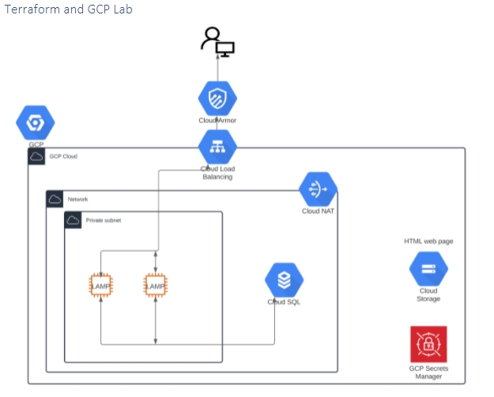

## Task Terraform-GCP



### Create an infrastructure, which is described on the diagram above. 

### Main goals.

1.  Create Network and private subnetwork.  
2.  Create 2 instances with LAMP stack. Instances should be in the private subnet and do not have public IP addresses.
3.  You should be able to SSH to the instances with tag `ssh` only from your IP address. 
4.  Instance should be able to pull config from Cloud Storage. 
5.  LAMP stack should be installed on the instances during instance provisioning. 
6.  Instances should have access to the Internet.
7.  Database should be in Cloud SQL service. 
8.  Password for database should be located inside secret manager.
9.  HTMP page (index.html) should be located inside Cloud Storage bucket.
10. LAMP stack should be accessible over the internet using load balancer AND only from your IP address.
11. Backups for cloud SQL database should be configured. 

### General rules: 

* Your code should be in EPAM GitLab repository and accessible for reviewers. 
* You should create your infrastructure using one terraform command. Manual changes are not allowed. 
* Terraform backend state should be in GCS. 
* Needed attributes for your terraform code should be parametrized (Example: Customer may want to increase or decrease instance type if needed in some period of time). 
* Use Terraform linters to meet all terraform best practices in code writing. 
* Use Terraform modules as much as possible (when it is needed). 
* Your infrastructure should follow best practices for GCP and Terraform. 

--------------------------------------------

## Solution

### 0. Prepare working environment. Create working container with cloud-sdk + terraform

```
# Start container
docker run -it --rm -v ${PWD}:/work -w /work work-container:v1
```

* Create sub-project for GCS remote state

```
# .tf files in ./remote-state/ folder
``` 

* Use environment variable for terraform authentication

```
export GOOGLE_APPLICATION_CREDENTIALS="/work/tf.json"
```

### 1. Create Compute module.

* Module include:
* Network with private subnet. Cloud NAT.
* Forwarding rules for access.
* Instance tempate, MIG, autoscaler and LoadBalancer.
* Cloud Armor for LB

```
# Module files in ./compute/ folder
```

### 2. Create Bucket module

* Module include:
* Bucket with startup script and index.html for Apache web-server.
* Startup script for instance template with LAMP stack and added metadata to index.html

```
# Module files in ./bucket/ folder
```

### 3. Create CloudSQL module

* Module include:
* MySQL instance
* MySQL database
* Secret Manager `secret` with db password

```
# Module files in ./cloudsql/ folder
```

* Test connection from VM to CloudSQL instance

```
# Connect 
mysql --host=<ip.addr> --user=<user>  --password

# Check databases
SHOW databases;
```

---------------------------------------------------